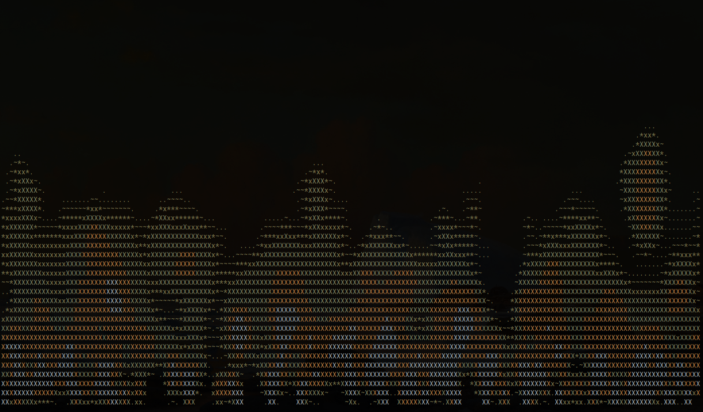

# flames

A cute simulation of fire, with a curses front-end just for your terminal.

My interpretation of [this gist](https://gist.github.com/msimpson/1096950#file-cfire) from GitHub user msimpson.

# Usage

`python flames.py`

# Screenshots

